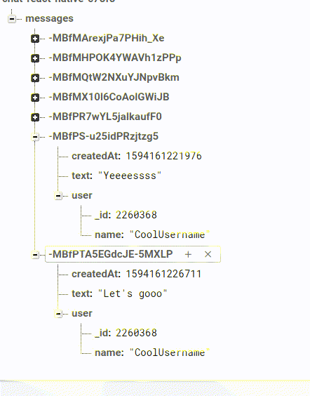

# Chat with React Native
This is a simple chat app made with React Native, using Firebase Realtime Database.

The objective is to show how to integrate Firebase Realtime Database to make a chat with RN. You can use the code here as an example to make your own implementation, adding new features, like one-to-one chat, insert avatar images, user persistence and many other things!

### Demo
This is what the app looks like.  

This is what the Database looks like. Note the JSON structure and the new messages arriving.  

